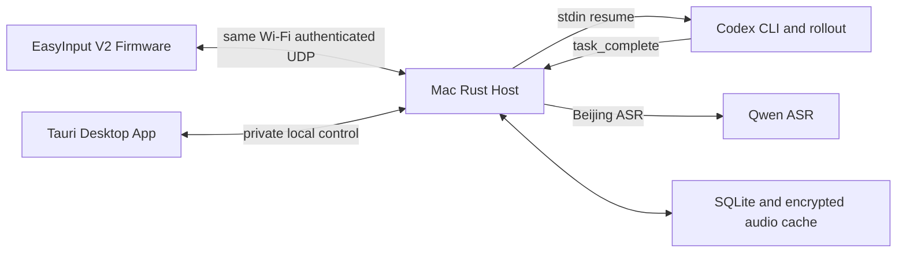

# Codex Keyboard 本地 Wi-Fi 总体方案

## 产品定义

Codex Keyboard 是一个四槽实体 Codex 终端。EasyInput V2 和 Mac 必须在同一局域网：

| 按键 | 行为 |
|---|---|
| S1-S4 | 对槽位 1-4 按住说话，松开后 ASR 并进入对应 Codex task FIFO |
| S5-S8 | 打开槽位 1-4 的对应消息。完成时的语音已经由键盘自动播出，这里不再播放 |
| 旋钮逆时针 / 顺时针 | 键盘板载扬声器音量减小 / 增大 |
| 短按旋钮 | 播放预置的当前音量播报；长按 3 秒仍进入配置模式 |

绑定不写入固件。桌面 App 从本机 Codex catalog 选择 task，Host 原子保存 `slot -> task UUID`；
固件永远只发送 `slot=1..4`。

旋钮不进入 Codex 槽位协议，也不依赖桌面 App。固件将物理旋转映射为 10 档板载 PCM 播放增益，
逆时针降低、顺时针提高；音量持久保存到设备 NVS，并立即作用于正在播放和后续播放。短按旋钮时，
固件从 App 镜像中直接播放提前由 Qwen TTS 生成的对应档位提示音，运行时不请求网络，也不改变 Mac
系统音量。长按 3 秒仍进入配置模式。

## 部署单元

本仓没有 PWA、Cloudflare、Relay、手机播放或远程路径。Host 和键盘之间没有公网依赖；Qwen ASR 和
Codex 模型调用仍需要 Mac 具备互联网连接。完成播报用键盘里预置的一句，不再每次请求云端。

## Source of Truth

| 对象 | 唯一所有者 |
|---|---|
| 四槽绑定、prompt FIFO、completion cursor | Host SQLite |
| 未读 summary generation、playback lease | Host SQLite |
| 四槽未读 bitmask、累计 completion coverage | Host SQLite 派生快照 |
| 已绑定任务运行数 | Codex 为 Host rollout observer 的 `task_started -> task_complete`；Grok、Claude、DeepSeek 为 Host 作业的排队或执行 |
| WAV/EIAD 密文缓存 | Host 私有文件系统 |
| Codex task transcript | Codex 本地状态 |
| 按键、连接 generation、采集/播放 buffer | Firmware RAM/PSRAM |
| Wi-Fi SSID/密码、Host IPv4/port、device secret | Firmware NVS |

## 上排语音链

1. S1-S4 按下后固件先抢占播放，再启动 16 kHz mono PCM16 采集。
2. EICC 控制会话建立后，EIAU v3 帧携带 slot、capture generation、route generation、sequence 和 HMAC。
3. Host 严格验证来源、鉴权、顺序、长度和结束包；空音频、缺帧、旧 generation 均拒绝。
4. Host 默认调用北京区 `qwen3-asr-flash`，成功文本以 durable request 写入 task FIFO。
5. 同 task 永不并发，prompt 经 stdin 传给 `codex exec resume --json <task-id> -`。

## 完成播报

只有权威完成才推进 completion ledger。Codex 仍只认 rollout 的 `task_complete`。Host 不再写口播稿。
播报原文固定为「任务一已完成」「任务二已完成」「任务三已完成」「任务四已完成」，由绑定槽决定。
页面同样标出这句，回复原文留在阅读页。

这一句用龙川叔 `longchuanshu_v3.6` 预先做好，放在键盘固件里。Host 完成记账后立刻发布，未听灯随心跳点亮，键盘同时播出板载的那一句。
不再为每次完成请求云端合成。同一任务一次只发布一份。完成播报不计入第 5 颗灯的运行数。第 5 颗灯没有正在跑的任务时就是绿色。

ASR 仍是北京区 `qwen3-asr-flash`。旋钮短按的音量提示仍是固件里预置的龙安风悦。

DashScope key 只在同一 App Support 根下的 mode-0600 `.env`；cache/device secret 也只在本机私有文件。

## 下排

1. S5-S8 把窗口叫到前面，打开对应槽，不再播放「任务N已完成」。键盘发出打开请求后马上回到空闲。
2. 没有未听的完成句时，Host 不下载、不播放。
3. 完成当下由键盘播放固件内的那一句。
4. 按下已认证的新播放键后，Host 把这一句标成听完、灭灯并删除缓存。
5. 重放、取消、PTT 抢占、超时、断线和播放失败都不能把还没确认的这一句标成听完。

## 五灯状态条

1. 固件的周期 EIHB 心跳序号同时作为一次性 challenge；Host 只响应通过 device secret HMAC 的完整
   80-byte 心跳，并返回固定 32-byte `EIMB v3`。
2. EIMB 携带四槽未读 bitmask、四个逐槽 completion coverage byte、0-4 的运行任务数、字节 7 的
   北京区故障位（只允许 0 或 1）和 HMAC，不携带 task UUID、摘要正文或缓存标识。健康时字节 7 为 0。
3. 固件只接受已配置 Host IPv4、正确 device secret HMAC 且回显最新心跳序号的包；旧包、错来源和
   伪造包均不能改变灯光。
4. 左起第 1-4 颗灯一一对应槽 1-4，还有没听的完成播报时才亮绿色。Codex、Grok、Claude、DeepSeek
   共用这四颗灯。1 次未听至少和最右空闲绿灯一样亮，coverage 从 1 到 16 单调增亮，之后饱和。
5. 最右第 5 颗灯在没有故障时表示已绑定任务的运行总数：0 个绿色、1 个黄色、2 个橙色、3 个紫色、
   4 个红色。Codex 从权威 `task_started` 计到匹配的 `task_complete`。Grok、Claude、DeepSeek 从作业入队计到
   完成或失败。重复绑定同一个 task 只计一次，全部结束后回到绿色。没连上 Wi-Fi、连不上 Host，或北京区
   密钥缺失、被拒绝、连不上时，只让这一颗红灯亮灭交替；左起四颗仍表示未听。
6. 按键、录音、播放、配置和错误等直接反馈可以临时覆盖五灯，反馈结束后恢复最新四槽信箱与任务活动
   状态。完成播报的灯在按下已认证的新播放键后熄灭。键盘自己播出的那一句不灭灯。

## 配网

首选 Mac 通过 USB HID 管理 report 下发与 BLE GATT 相同的 S3C 配置。密码从 stdin 读取，不进入
argv、日志或数据库。USB 不可用时可使用 BLE GATT；运行时音频始终只走 Wi-Fi。

## macOS 安装

桌面管理端打包为 `/Applications/Codex Keyboard.app`，bundle id 为
`com.larkspur.codex-keyboard`，使用项目专属的八键和声波图标。常驻 Host 仍由用户级 LaunchAgent
独立运行；关闭桌面窗口不会中断任务观察、摘要生成或键盘局域网服务。

## 验收边界

- Rust/TypeScript/C++ 自动化证明协议和状态机，不证明扬声器可听。
- ESP-IDF build 证明镜像可生成，不证明可安全烧录。
- Host `healthy=true` 证明常驻服务，不证明键盘网络或 I2S。
- 最终产品必须用真实键盘、真实局域网、真实 Qwen/Codex 和 exact cache deletion 分别验收。
